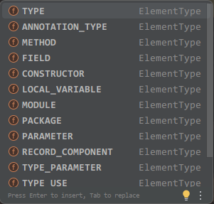

# Ch9

## Test

断言
```java

@Test
public void refDemoTest() {
    int li = refDemo();
    Assert.assertEquals("TestFailed", -1, li);
}
```
`public static void assertEquals(message, expected, actual)`

---

|注解||
|---|---|
@Test|测试基本单元
@Before|每个测试单元前会执行，用于初始化资源
@After|测试单元后会执行，释放资源
@BeforClass|修饰静态方法，所有测试方法之前执行一次
@AfterClass|修饰静态方法，所有测试方法之后执行一次

## Reflection

加载类，并允许以变成的方式解剖类中的各种成分(成员变量、方法、构造器等)

```java
Class<Student> c1 = Student.class;
System.out.println(c1);

Constructor<Student> constructor = c1.getDeclaredConstructor(String.class, Integer.class);

Student student = constructor.newInstance("atao", 21);

Field field = c1.getDeclaredField("name");

field.setAccessible(true);

field.set(student, "b1ss");

System.out.println(student);
```

### 修改 static final 修饰的属性

```java
public class Student {
    private String name;
    private Integer age;

    public static final String university = new String("CMU");

    /*...*/
}
```

---

```java
Class<?> clazz = Class.forName("com.atao.reflection.Student");
Field fieldUniversity = clazz.getDeclaredField("university");
fieldUniversity.setAccessible(true);

Field modifiers = Field.class.getDeclaredField("modifiers");

modifiers.setAccessible(true);
modifiers.setInt(fieldUniversity, fieldUniversity.getModifiers() & ~Modifier.FINAL);

Student student = new Student();
fieldUniversity.set(null, "MIT");

System.out.println(Student.university);
```

只能在JDK1.8使用

JDK12以上就只能通过Unsafe来实现了

JDK21以上Unsafe也不行了

这方面之后再研究

`Field`类中的`modifiers`属性是`private int modifiers`

值设置十分巧妙

举例

```java
public static final int PUBLIC = 0x00000001;   // 0001

public static final int PRIVATE = 0x00000002;  // 0010

public static final int PROTECTED = 0x00000004;// 0100

public static final int STATIC = 0x00000008;   // 1000
```

因此 通过反射取到的一个标识符为`public static`的`Field`实例的`modifers`属性值为`0x00000009` 二进制最后四位是`1001`

上面案例的代码通过对`FINAL`取非后做掩码计算来去掉`final`修饰符后再修改值

!!! annotation
    这是因为java编译器对final修饰属性进行的内联优化 即编译时将final的值直接放到了引用他的地方,即使通过反射修改了该属性 也没啥用

    `byte` `short` `int` `long` `float` `double` `boolean` `char` LiteralString(直接双引号括起来的字符串) 这些都会优化

    new 的String比较特殊 可以被有效修改 其余类型的包装类也是如此


## Annotation

Java代码里的特殊标记，让其他程序根据注解信息来决定如何执行

自定义注解

```java

public @interface name default value

```

如果注解属性只有一个value可以不写value

注解本质是个接口，Java所有的注解都继承了Annotation接口

@Anno(...)就是一个实现了注解接口匿名内部类实例

## 元注解

Meta-Annotation

注解注解的注解

```java

@Target(ElementType.TYPE)
//限制被修饰的注解可以用的范围

@Retention(RetentionPolicy.RUNTIME)
//限制被修饰的注解的声明周期

```



## 反射解析注解

```java

public Annotation[] getDeclaredAnnotations()

public T getDeclaredAnnotation(Class<T> annotationClass)

public boolean isAnnotationPresent(Class<? extends Annotation> annotationClass)

```

## 动态代理

//todo: 