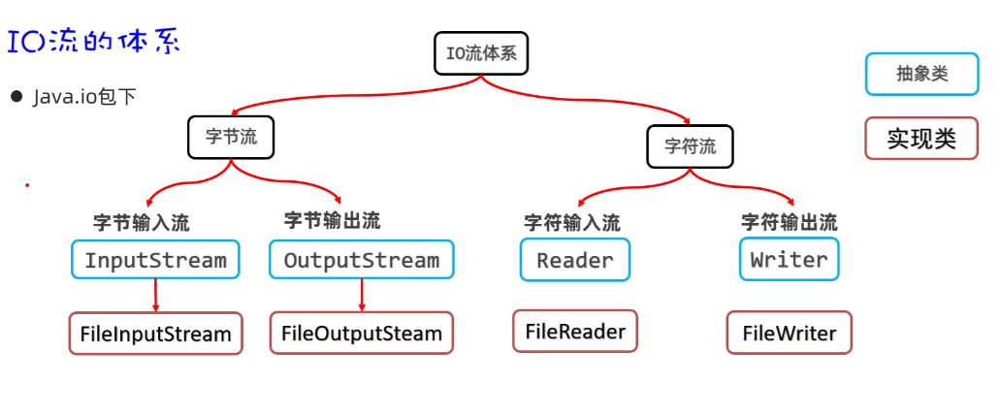

# Ch4

## IO

### 字节流



字节流一个字节字节读取，需要操作系统磁盘IO操作占用总线，性能很差

一次单独读取一个字节，容易发生字符截断

```java

InputStream is = new FileInputStream();

byte[] buffer = new byte[3];
int len;
while ((len = is.read(buffer)) != -1) {
    System.out.print(new String(buffer, 0, len));
}

```

复制文件

```java

public static boolean copy( File origin, String destination) {
    if (!origin.exists() || origin.isDirectory()) return false;
    String url = new String(destination + File.separator + origin.getName());
    File yankFile = new File(url);

    try (
            InputStream inputStream = new FileInputStream(origin);
            OutputStream outputStream = new FileOutputStream(yankFile);
    ) {
        if (!yankFile.exists()) yankFile.createNewFile();
        byte[] buffer = new byte[(int) KB];
        int len;
        while ( (len = inputStream.read(buffer)) != -1) outputStream.write(buffer, 0, len);
    } catch (Exception e) {
        throw new RuntimeException(e);
    }
    
    return true;
}

```

### 字符流

基本上和字节流一样，只不过最小单位是一个char