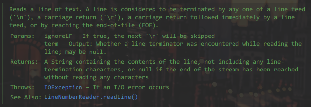

# Ch5

## BufferedReader/Writer & BufferedIn/OutputStream

```java

BufferedReader bufferedReader = new BufferedReader(new FileReader("your/file/url/here"))

```

都是类似的声明，`BufferedReader/Writer`提供了新的方法`readLine`会读到换行符停下。不会读进换行符。




## InputStreamReader & OutputStream

```java

public InputStreamReader(InputStream inputStream, String charset)

public OutputStreamWriter()

```

## PrintStream

打印流

`System.out.println()` 

`System.out`就是一个静态打印流

可以`System.setOut()`重新定向标准输出流

同样可以重新定向标准错误流或者标准输入流

## DataOutPutStream

数据输出流

必须怎样写怎样读

`writeInt`->`writeString`->`writeChar`->`writeBoolean`

`readInt`->`readString`->`readChar`->`readBoolean`

## ObjectInput/OutputStream 

类对象序列化、反序列化流，以字节形式输入输出

// modifacator `transient` 不会被序列化

## 框架IO


