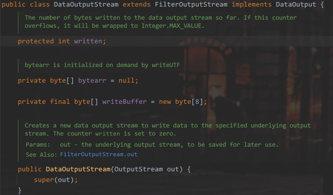

# Ch8

## ip addr

`internet protocol`

`IPv4`&`IPv6`

IPv4 32bit 4bytes 

IPv6 4


## DNS server

Domain Name System

## port

16位二进制 0-65535

- 周知端口 0-1023，给预先定义的指明应用(HTTP80, FTP21)
- 注册端口 1024-49151，分配给用户进程或某些应用程序
- 动态端口 49152-65535，不固定分配

### 协议

应用层协议

## UDP

## TCP通信

面向链接，可靠通信，三次握手

`java.net.Socket`

```java
// server

package com.atao.tcp;


import java.io.DataInputStream;
import java.io.IOException;
import java.net.ServerSocket;
import java.net.Socket;

public class Server {
    public static void main(String[] args) {
        try (ServerSocket server = new ServerSocket(8080)) {
            Socket socket = server.accept();

            //?
            DataInputStream dis = new DataInputStream(socket.getInputStream());

            System.out.println(dis.readInt());
            System.out.println(dis.readUTF());

            socket.close();

        } catch (IOException e) {
            throw new RuntimeException(e);
        }

    }
}
```

```java
// client

package com.atao.tcp;

import java.io.DataOutputStream;
import java.io.IOException;
import java.net.Socket;

public class Clint {
    public static void main(String[] args) {
        try(
                Socket socket = new Socket("localhost", 8080);
                // ?
                DataOutputStream dos = new DataOutputStream(socket.getOutputStream())
        ) {
            dos.writeInt(12);
            dos.writeUTF("韭菜盒子鸡蛋灌饼煎饼果子");

        } catch (IOException e) {
            throw new RuntimeException(e);
        }
    }
}
```

### 关于IO流



这里调用的构造方法就是拿一个字节输出流对象丢进`super()`

`DataOutputStream`类继承自`FilterOutputStream`

后者成员属性就有一个`protected OutPutStream out;`

构造器就是`this.out = out;`

一类像这样层层嵌套的IO流

```java
new BufferedReader(new InputStreamReader(new FileInputStream("../filename"), StandardCharsets.UTF_8));
```

最内层嵌套的是什么流这个对象实质上就是条什么流，外层包的这些都是给流提供一系列规约和高级方法


在上面的TCP通信案例中，Clint向Server写入数据的流是包装成`DataOutputStream`的`OutputStream`，虽然调用高级方法写入数据，最终写入流中的还是字节数组。同理在服务端通过`socket.getInputStream()`拿到的同一个流，包装成`DataInputStream`后通过调用对应的高级方法拿数据

### 多发多收

```java
// Client
package com.atao.tcp;

import java.io.*;
import java.net.Socket;
import java.util.Scanner;

public class Client {
    public static void main(String[] args) {
        try(
                Socket socket = new Socket("localhost", 8080);

                DataOutputStream dos = new DataOutputStream(socket.getOutputStream())
        ) {
            Scanner scanner = new Scanner(System.in);
            while (true) {
                dos.writeUTF(scanner.nextLine());
            }
        } catch (IOException e) {
            throw new RuntimeException(e);
        }
    }
}
```

```java
//Server

package com.atao.tcp;


import java.io.IOException;
import java.net.ServerSocket;
import java.net.Socket;

public class Server {
    public static void main(String[] args) {
        try (ServerSocket server = new ServerSocket(8080)) {
            Socket socket = null;
            while (true) {
                socket = server.accept();
                System.out.println("attach from ==> " + socket.getInetAddress().getHostAddress());
                new ClientReader(socket).start();
            }

        } catch (IOException e) {
            throw new RuntimeException(e);
        }

    }
}
```

```java
//ClientReader

package com.atao.tcp;

import java.io.DataInputStream;
import java.io.IOException;
import java.net.Socket;

public class ClientReader extends Thread {
    private Socket socket;

    public ClientReader(Socket socket) {
        this.socket = socket;
    }

    @Override
    public void run() {
        try(DataInputStream dis = new DataInputStream(socket.getInputStream())) {

            while (true) {
                System.out.println("Read from " + socket.getInetAddress().getHostAddress() +" MSG:" + dis.readUTF());
            }
        } catch (IOException e) {
            System.out.println("Detached from ==> " + socket.getInetAddress().getHostAddress() + ":" + socket.getPort());
        }
    }
}
```