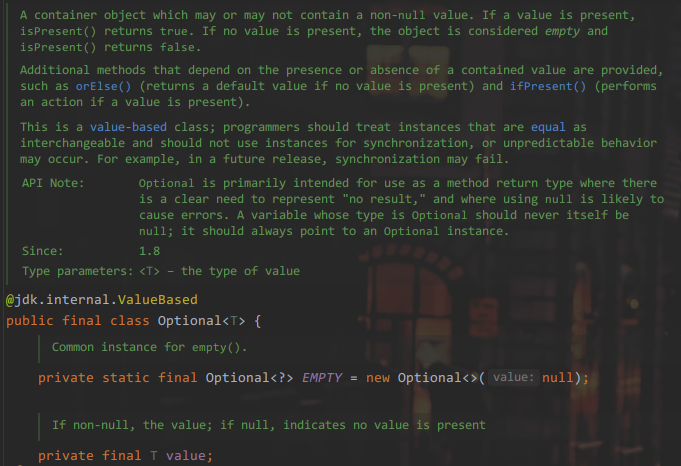

# Ch3.1

读几个jdk8新特性的源码

## Optional



一个定义为final的类，内有两个成员变量属性`EMPTY`和`value`

- `EMPTY`: 是由构造器返回的`Optional`类型的对象，修饰符是`private static final`意味着这是类的属性不会与实例相关，会在类被加载时初始化并且全程只有一个实例，典型的单例设计模式 _singleton design pattern_
- `value`: 类型则是泛型定义的，类的实例属性

构造器很标准，就是`this.value = value`，但是由`private`修饰的

下面来看他的成员方法

### empty

```java

public static<T> Optional<T> empty() {
    @SuppressWarnings("unchecked")
    Optional<T> t = (Optional<T>) EMPTY;
    return t;
}

```
静态方法，直接返回EMPTY，并且做了强转

### of & ofNullable

```java

public static <T> Optional<T> of(T value) {
    return new Optional<>(Objects.requireNonNull(value));
}

public static <T> Optional<T> ofNullable(T value) {
    return value == null ? (Optional<T>) EMPTY
                            : new Optional<>(value);
}

```

返回对象的方法，`of`遇空值直接`NullPointerException`，`ofNullable`遇空值返回`EMPITY`也是强转了的

### get

```java

public T get() {
    if (value == null) {
        throw new NoSuchElementException("No value present");
    }
    return value;
}

```

有值取值，无值抛继承`RuntimeException`的错

### isPresent & isEmpty

```java

    public boolean isPresent() { return value != null; }

    public boolean isEmpty() { return value == null; }

```

### ifPresent & ifPresentOrElse

```java

    public void ifPresent(Consumer<? super T> action) {
        if (value != null) {
            action.accept(value);
        }
    }

        public void ifPresentOrElse(Consumer<? super T> action, Runnable emptyAction) {
        if (value != null) {
            action.accept(value);
        } else {
            emptyAction.run();
        }
    }

```

感觉用在Lambda中比较方便

```java

        if (file != null) {
            file.delete();
        } else {
            throw new NullPointerException();
        }
        
        Optional.of(file).ifPresentOrElse(File::delete);

```

谁更简洁还未必，流汗了家人们

> if a value is present and the given action is null, or no value is present and the given empty-based action is null.

### filter & map

> If a value is present, and the value matches the given predicate, returns an Optional describing the value, otherwise returns an empty Optional.

> If a value is present, returns an Optional describing (as if by ofNullable) the result of applying the given mapping function to the value, otherwise returns an empty Optional.

### 余下但是更多

|methods|descriptions|
|---|---|
|`flatMap`|If a value is present, returns the result of applying the given Optional-bearing mapping function to the value, otherwise returns an empty Optional.
|`or`|If a value is present, returns an Optional describing the value, otherwise returns an Optional produced by the supplying function.
|`stream`|If a value is present, returns a sequential Stream containing only that value, otherwise returns an empty Stream.
|`orElse`|If a value is present, returns the value, otherwise returns other.
|`orElseGet`|If a value is present, returns the value, otherwise returns the result produced by the supplying function.
|`orElseThrow`|If a value is present, returns the value, otherwise throws NoSuchElementException.
有病|`<X extends Throwable> T orElseThrow(Supplier<? extends X> exceptionSupplier) throws X`
`equals`|Indicates whether some other object is "equal to" this Optional.
`hashCode`|Returns the hash code of the value, if present, otherwise 0 (zero) if no value is present.

## Stream

今天的另一篇写了


---

> [你真的开始用JDK8了么？](https://github.com/muyinchen/woker/blob/master/JAVA8/%E4%BD%A0%E7%9C%9F%E7%9A%84%E5%BC%80%E5%A7%8B%E7%94%A8JDK8%E4%BA%86%E5%90%97%EF%BC%9F.md)

> [12 recipes for using the Optional class as it’s meant to be used](https://blogs.oracle.com/javamagazine/post/12-recipes-for-using-the-optional-class-as-its-meant-to-be-used)