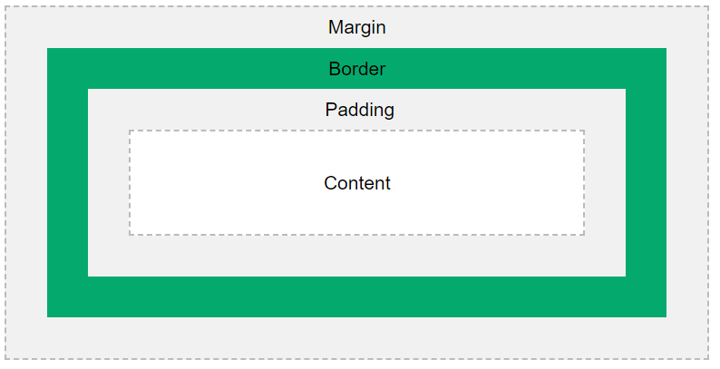

# Ep1

## Html & CSS & js

前端三大件

- Hyper Text Markup Language
- Cascading Style Sheet
- JavaScript

html 没啥好说的，多写多看。

css 选择器有点意思的，有个小游戏可以练下:

> [CSS dinner - Where we feast on Css Selectors!](https://flukeout.github.io/)

JavaScript... 我讨厌 JavaScript

### Box Model

Css盒模型，本质上是包围在所有HTML元素外部的一个盒子，从外到内分别是`Margin` `Border` `Padding` `Content`

!!! notice

    在 CSS 中为一个元素设置宽高时，只是设置了内容区域的宽高。要计算整个元素的宽高还需要加上内边距和边框。

