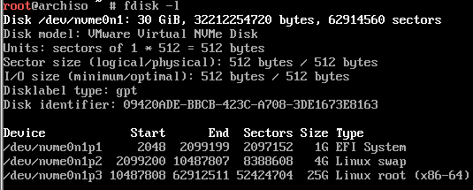
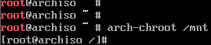

# Arch安装

竟然8个月没有更，来深圳已经有8个月了

依旧是没有工作

最近换成用虚拟机了，装了个Arch，期望是能用IDE的远程功能连上虚拟机开发

win就是一坨，一直想要换用Linux做主力环境，但是也一直不能下定决心，可能就是这样的性格

闲话扯到这里

## Arch Install

wiki上是十分详细的，就算从来没有接触过直接照着一步步来估计也不会有多少问题

### archiso&fdisk&mount

先要确保archiso连上了网，插网线dhcp是自动启用的，wifi和拨号要手动一下，确认`ping archlinux.org`

然后就是确认下启动是bios还是uefi`cat /sys/firmware/efi/fw_platform_size` 有这个文件就是uefi启动了，不然就是BIOS或者CSM

---

uefi要用gpt格式分盘，也就是要有一个专门的esp`EFI system partition`分区。windows一般还会留个msr[`Microsoft Reserved Partition`](https://en.wikipedia.org/wiki/Microsoft_Reserved_Partition)分区，我也不知道是干啥的，贴了wiki了


分区没啥问题，反正就是照着wiki上推荐的来，空间统统塞进根目录，也不用单独去给`/home`、`/usr`之类的目录分区了

不记得之前有没有设置partition type了，没多大印象了，可能之前没有操作这步，这个操作起来还是挺麻烦的，下次试试`cfdisk`



格式化的时候注意下swap分区特殊点，是用的`mkswap`，然后就是esp分区是fat32格式

```bash
mkfs.vfat -F 32 /dev/your_partition
```

---


磁盘分好后就是挂载了，挂载没啥说的，照着wiki来就是

```bash
# --mkdir create directory if it dosen't exist
mount /dev/root_partition /mnt
mount --mkdir /dev/esp /mnt/boot

swapon /dev/swap_partition
```

### mirrorlist&pacstrap

之前的准备工作之后，可以开始正式安装了


wiki上提供了 两个方案，手动修改或者用使用reflector来自动检索并按照下载速度排序，后者试过了不怎么好用。

```bash
reflector --country 'China' --age 12  --protocol https --sort rate --save /etc/pacman.d/mirrorlist
```

一般直接手动添加几个国内的镜像源进去就行了

用pacstrap来一键安装别人打包好的程序包，也可以自己手动安装，不管怎样都要从网上下载，iso文件里是不带有安装包的

```bash
pacstrap /mnt base base-devel linux linux-firmware vim e2fsprogs neofetch
```

- base是元软件包
- base-devel是基础软件包组
- linux是内核
- linux-firmware是固件包
- vim编辑器
- e2fsprogs是ext4文件系统需要的工具

linux可以替换为arch wiki [Kernel](https://wiki.archlinux.org/index.php/Kernel)页面的其他内核

## Configurate


要生成[fstab](https://wiki.archlinux.org/title/Fstab)文件，file system table

```bash
genfstab -U /mnt >> /mnt/etc/fstab
```
这里用了`>>`操作符将`genfstab`的标准输出流重定向并追加至`/mnt/etc/fstab`文件中

上述的命令不会有任何的输出，自己检查下生成的文件`less /mnt/etc/fstab`

确认无误后可以进入下一步了，正式进入刚刚安装完成的新系统

```bash
arch-chroot /mnt
```

在manpage可以看到，arch的这个chroot如果在没有指定[command]的情况下会默认启动/bin/bash，这个命令的完整版本应该是`arch-chroot /mnt /bin/bash`



### locale&datetime

```bash
ln -sf /usr/share/zoneinfo/Asha/Shanghai /etc/localtime
hwclock --systohc --utc
datetimectl set-ntp true
```


编辑`/etc/locale.gen`取消`en_US.UTF-8 UTF-8`这一项的注释然后运行`locale-gen`

### Keymaps

`showkey`会开始监听键盘输入，然后console给你响应的keycode，如果想要看scancode就是`showkey --scancode`，过一段时间就会结束

知道keycode后就可以去修改keymaps了
```bash
vim /usr/local/share/kbd/keymaps/personal.map

# personal.map
keycode 1 = Caps_Lock
keycode 58 = Escape

```

对当前终端生效: `loadkeys keymap`

持久化生效: `vim /etc/vconsole.conf`
系统启动时systemd会去读取这个文件，记得写绝对路径，不要写错

### network

路由器拨号插线的直接不用管，DHCP是自动启用的

配置一下hostname和hosts分别位于`/etc/hostname`，`/etc/hosts`

dhcp是自动启用的没错，但是dhcp不是默认安装的，虽然archios里面有。两次都忘记装dhcp结果退回archiso里面重新下dhcp

```bash
pacman -S dhcpd
systemctl enable dhcpd
```

### ucode&grub

```bash
pacman -S amd-ucode
#for intel user
#pacman -S intel-ucode 
```
UEFI引导
先安装软件
```bash
pacman -S grub efibootmgr
```
然后把引导写入
```bash
grub-install --target=x86_64-efi --efi-directory=/boot -bootloader-id=grub --recheck

grub-mkconfig -o /boot/grub/grub.cfg
```
确认到输出结果后就算完成了，可以reboot了

### user&usergroup

先给root用户一个密码吧`passwd`

然后弄个日常用户
```bash
useradd -m -G wheel -s /bin/bash atao
```
我自己个人用的电脑，就直接去visudo里面把wheel组直接免密启用了
```bash
EDITOR=vim visudo

## Defaults specification
Defaults editor=/usr/bin/vim

## Uncomment to allow members of group wheel to execute any command
%wheel ALL=(ALL:ALL) ALL

## Same ting without a password
%wheel ALL=(ALL:ALL) NOPASSWD: ALL


passwd -d atao
```
不然这里不设置用户密码都不让进系统实在麻烦

>[Can I set my user account to have no password?](https://askubuntu.com/questions/281074/can-i-set-my-user-account-to-have-no-password)

---

用IDE或者VScode这样的工具远程连接虚拟机成功实现

后面会有介绍，此篇文章就是用VScode通过SSH协议连接虚拟机写的，MKdocs也能开放远程监听，十分方便

!!! note
    archlinuxcn的keyring出了点小问题，要手动trust一下
    
    详见[新系统中安装 archlinuxcn-keyring 包前需要手动信任 farseerfc 的 key](https://www.archlinuxcn.org/archlinuxcn-keyring-manually-trust-farseerfc-key/)