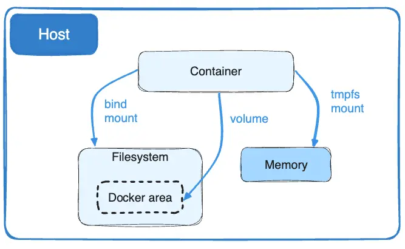

# Docker入门之读文档

> Docker is an open platform for developing, shipping, and running application.

## Docker Engine

### Get Docker

去你妈的docker desktop好吧

>https://wiki.archlinux.org/title/docker

```bash
sudo pacman -S docker

sudo systemctl enable docker.socket
sudo systemctl start docker.socket
```

docker.socket的优势在于指令调用时才初始化docker，而不是开机就初始化

archwiki上有提到如果启用了一个VPN，有可能导致VPN和Docker的网桥的IP冲突而启动失败，可以先停用VPN在启动Docker后再次尝试链接

---

将用户加入`docker`用户组来给用户提权

!!! warning
    任何添加进docker用户组的用户可以等同于赋予了root权限，他们可以用`docker run --privileged`指令来以root权限启用容器
    
    ['docker' group is root equivalent and bypasses policy, audit](https://github.com/moby/moby/issues/9976)
    
    [Docker security](https://docs.docker.com/engine/security/)

### Data in Docker

通常，所有的文件在容器内部创建，并存储在一个可写的容器层(writable container layer):

- 当容器不再存在时，数据也不再存在。同时，如果一个其他的进程需要，想要把数据拿出容器外是十分困难的
- 当容器运行时，它的可写层和运行容器的宿主机是高度耦合的，不能移动容器内容

- 向容器可写层写入时需要一个[存储驱动程序(storage drive)](https://docs.docker.com/storage/storagedriver/)来管理文件系统。存储驱动程序提供了一个统一的文件系统，使用Linux内核。这层额外的抽象相较与使用数据卷直接在宿主机的文件系统上写入降低了性能。写入密集型应用，比如数据库会受到性能开销的影响，尤其是在只读层里面已有数据的情况下。

#### Storage Driver

docker使用存储驱动程序来储存镜像层、容器的可写层数据。容器的写入层数据在容器删除时就不再存在，但是适合用于存储运行期间产生的暂时数据。存储驱动向空间存储效率方向最优化，但是比直接向文件系统写入低效，尤其是相较于使用copy-on-wirte策略的文件系统。

可以使用docker数据卷(Docker volumes)来存储写入密集型，必须在容器生命周期外持续，必须在两个容器之间共享的数据。

---

#### Volumes

(docker)数据卷是持久化存储docker容器产生和使用的数据的首选机制。相比与bind mounts依赖于宿主机的目录结构和OS，数据卷直接由docker管理。

- 相比绑定挂载，数据卷更容易备份或者迁移
- 可以直接用Docker CLI命令或者Docker API管理数据卷
- linux和windows平台都可以使用数据卷
- 在不同容器间共享数据，数据卷更安全
- 数据卷可以让你在远程服务器或者云端存储数据，加密数据卷内容，或者添加其他功能
- 可以先向数据卷里添加数据，再填充至容器中
- 数据卷在Docker Desktop上性能表现比bind mounts更好

!!! addition
    如果容器产生非持续性的数据，考虑使用[tmpfs mount](https://docs.docker.com/storage/tmpfs/)来避免这些数据被永久存储，同时通过避免在可写层写入来提高容器性能



---

无论你选择何种类型的挂载，数据在容器内的形式看起来都是一样的。在宿主机的文件系统里，它以一个目录或者单文件的形式存在

| mount type | feature |
|---|---|
Volumes|存储在宿主集的文件系统中，由docker管理(`/var/lib/docker/volumes/`on linux)。非docker进程无法修改这部分文件系统
Bind mounts|可以存储在宿主机文件系统的任何地方，甚至可以是重要的系统文件或者路径，宿主机的非docker进程可以随时修改这些文件
tmpfs|只能挂载并存储在宿主机的内存中，并且从不写入宿主机的文件系统

绑定挂载和数据卷都可以通过`-v`或者`--volume`标识来挂载进容器，但是语法有些区别。对于`tmpfs`挂载，使用`--tmpfs`标识

---

可以通过`docker volume create`手动创建数据卷，当你创建一个容器或者服务时，docker也会创建一个数据卷

当你创建数据卷时，他里面的内容存储在docker宿主机的一个路径下，当你把这个目录挂载至容器里时，这个目录里就是你挂载到容器内的内容。

一个现存的数据卷可以被同时挂载至多个容器中，当没有运行中的容器在使用这个数据卷时，这个数据卷也仍然是可用的并且docker不会主动的移除它。你可以手动移除未被使用的数据卷：

```bash
docker volume prune
```

---

绑挂就是目录除了docker外宿主机的文件系统也可以访问，修改。

绑挂用例：

- 在宿主机和容器之间共享配置文件
- 在宿主机和容器之间共享源码或者组件


## Docker Compose

> Docker Compose is a tool for defining and running multi-container applications. It is the key to unlocking a streamlined and efficient development and deployment experience.

使用[YMAL](https://en.wikipedia.org/wiki/YAML)来定义容器属性，而不是一段包含了`docker run`的脚本文件。容器配置比较复杂的时候或者经常需要再配置时比较方便

```bash
sudo pacman -S docker-compose
```
