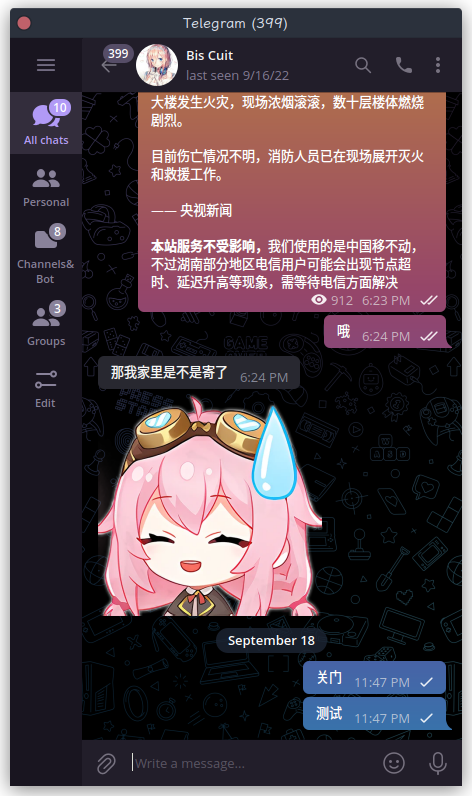
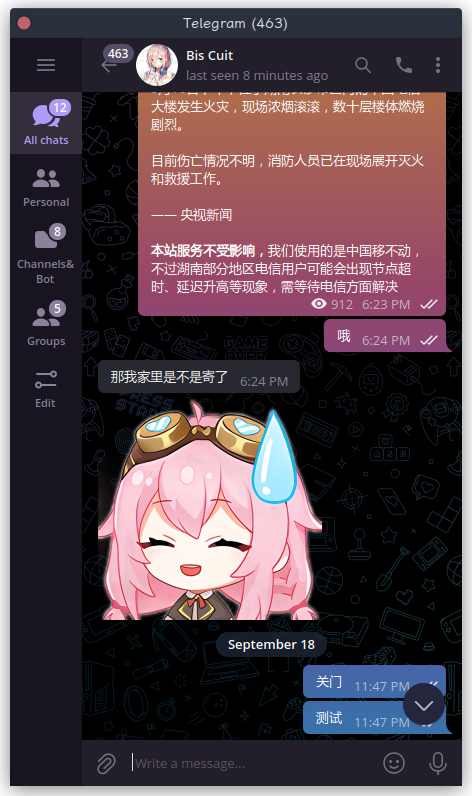

# 修改Telegram字体

Telegram是我用过体验最好的IM软件，没有之一

但是有一点我不满意，Telegram Desktop不能够使用用户设定的字体

之前在Windows上是通过一个Hook工具[FontMood](https://github.com/ysc3839/FontMod/blob/main/README.zh_CN.md)

但是在Linux上显然行不通，搜了一圈发现这个作者已经解决类似的问题，又回到[这里](https://github.com/ysc3839/FontMod/issues/6)

实际操作起来没什么技术含量，他的文本写得很清楚，代码层次也很清晰。但是我完全不懂linux编程，也不懂动态库连接。所以短时间内肯定是没办法读懂他的源码的

---
直接上效果

Before:




After:




---

很好很强大，一步到位写个.sh文件吧
```bash
export LD_PRELOAD=/home/atao/Desktop/hooktest.so
~/Downloads/Telegram/Telegram&
```
这里建议直接写绝对路径

