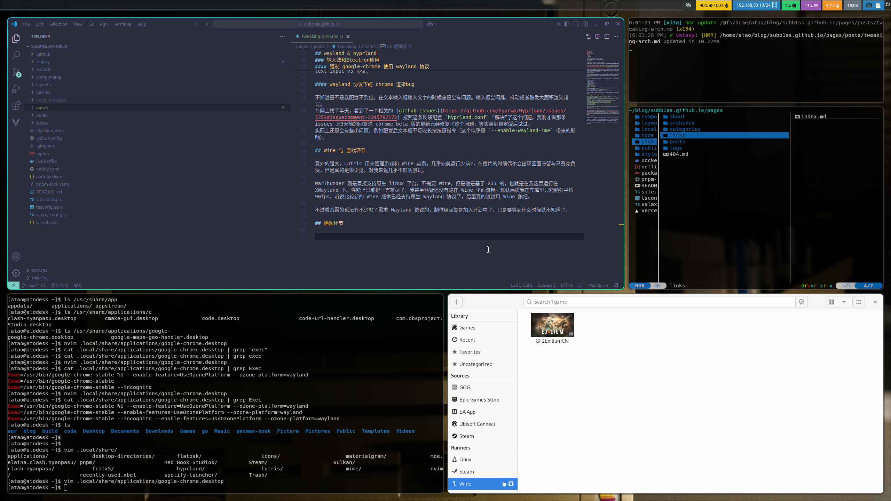

开个文章记录下折腾arch的过程，本文长期更新。  
遇到的一些重大问题会单独写一篇，这篇更偏向记录。

## 显卡驱动方面

我用的 Nvidia 显卡，以 linux 平台兼容性差而出名。  
实际上体验确实不好，有很多暗病，特别是在 hyprland 下。hyprland 是一款使用 wayland 协议的混成器，他是面向 AMD 显卡用户开发，但是也确实有不少的N卡用户在使用 hyprland。这样至少在排错的时候可以借鉴别人的经验。  


扯远了，安装显卡驱动的步骤其实还算是简单（即使这样也花了大概2、3个小时的时间）。可以直接参考 [wiki](https://wiki.archlinux.org/title/NVIDIA) 和 [Arch Linux NVIDIA drivers installation guide](https://github.com/korvahannu/arch-nvidia-drivers-installation-guide)。


我主要还是参考后面的那篇比较多，我本来是想要安装 dkms 版本的驱动的，但是在设置 Nvidia 模块早加载的那步无论如何都设置不成功，在没有装图形界面的时候想要去查资料也是个费心事，故放弃直接装了 linux 内核的驱动。什么时候把系统折腾崩了，大重装的时候再去装 dkms 版本把，验证下说 dkms 驱动在 wayland 协议下性哪更好的说法是否属实。不过我更先换 AMD 显卡也说不定哈哈。

## wayland & hyprland

这部分直接参考 hyprland 的官方文档上一步步来就好。我是装的 yay 版本，这样能第一时间跟进版本。  
hyprland 可定制度很高，但我没有去大改动，也没有直接拿别人现成的配置文件。直接拿别人的配置文件感觉不通读一遍的话，万一出问题会无从排查。我还是先尽量把系统配置到能用的程度，再去一步步配置自己的。

### 必用软件

hyprland 装完了还需要一系列的基础软件才能组装出一套可用的桌面系统。这部分在它自己的文档里都有提到，没得选的部分就直接略过了，按照文档上来就是。我这里说一下可选部分我的选择，以及一些我觉得很有必要的软件。

- 通知守护进程： mako
- 音频服务：pipewire
- 状态栏： waybar
- 壁纸：  hyprpaper
- 起动器： Rofi（Wayland fork）
- 粘贴版管理器： clipse
- 文本编辑器： nvim
- 文件管理器（TUI）： yazi

### 输入法和Electron应用

输入法当然是选择 Rime 输入法，linux上选择 fcitx5-rime 就可以了。我自己的 Rime 没有配置过多，就导入下之前自己打出来的词库就可以使用了。  
fcitx-rime 的用户配置目录位于 `~/.local/share/fcitx5/rime`  
说到 fcitx5，之前在公司里的 Mac 上使用的 fcitx5 Mac 着实惊艳到我了，卷轴模式简直更是神中神。肯定原生的 fcitx5 也是能支持卷轴模式的，之后再去折腾把。

不幸的，Electron应用在 Wayland 协议下的支持十分不友好，虽然可以用提供 X11 协议兼容的 XWayland，但是会有画面拉伸、闪烁等问题。总的来说我还是选择了 Wayland 协议。下面说下遇到的问题，就举例 google-chrome 这款程序吧。

#### 强制 google-chrome 使用 wayland 协议

google-chrome 默认是使用 XWayland 的，要强制启用 Wayland 协议就需要启动时传递参数 `--enable-features=UseOzonePlatform --ozone-platform=wayland` 或者，可以通过 chrome 自己的配置 `chrome://flags` 里面设置这两项  
我自己的解决方案是复制了一份 `/usr/share/applications/google-chrome.desktop` 到 `~/.local/share/applications/` 路径下，然后修改参数如下：  
```sh
[atao@atodesk ~]$ cat .local/share/applications/google-chrome.desktop | grep Exec
Exec=/usr/bin/google-chrome-stable %U --enable-feature=UseOzonePlatform --ozone-platform=wayland
Exec=/usr/bin/google-chrome-stable --enable-features=UseOzonePlatform --ozone-platform=wayland
Exec=/usr/bin/google-chrome-stable --incognito --enable-features=UseOzonePlatform --ozone-platform=wayland
```
这样通过 Rofi 启动也能带上参数了，启用输入法这部分取决于不同的 Electron 程序以及输入法引擎有很大不同。这部分具体请参搜索引擎， Chrome 方面我是在 `chrome://flags` 里面设置了，chrome 支持 wayland text-input-v3 协议。

#### wayland 协议下的 chrome 渲染bug

不知道是不是我配置不到位，在文本输入框输入文字的时候总是会有问题。输入框会闪烁、抖动或者触发大面积渲染错误。  
在网上找了半天，看到了一个相关的 [github issues](https://github.com/hyprwm/Hyprland/issues/7252#issuecomment-2345792172) 按照这条反馈配置 `hyprland.conf` “解决”了这个问题。我刚才看那条 issues 上3天前的回复说 chrome beta 版的更新已经修复了这个问题，等实装到稳定版后试试。
实际上还是会有些小问题，例如配置后文本框不接收长按按键指令（这个似乎是 `--enable-wayland-ime` 带来的影响）。

## Wine 与 游戏环节

意外的强大，Lutris 用来管理游戏和 Wine 实例，几乎完美运行少前2，在播片的时候偶尔会出现画面滞留与马赛克色块，但是真的是很少见，对我来说几乎不影响游玩。

WarThunder 则是直接支持原生 linux 平台，不需要 Wine。但是他是基于 X11 的，也就是在我这里运行在 XWayland 下。性能上只能说一言难尽了，我甚至怀疑还没有跑在 Wine 里面流畅。默认画质我在车库里只能勉强平均 90fps，听说比较新的 Wine 版本已经支持原生 Wayland 协议了，后面真的试试用 Wine 跑把。

不过看战雷的论坛有不少帖子需求 Wayland 协议的，制作组回复是加入计划中了，只是要等到什么时候就不知道了。

## 晒图环节

