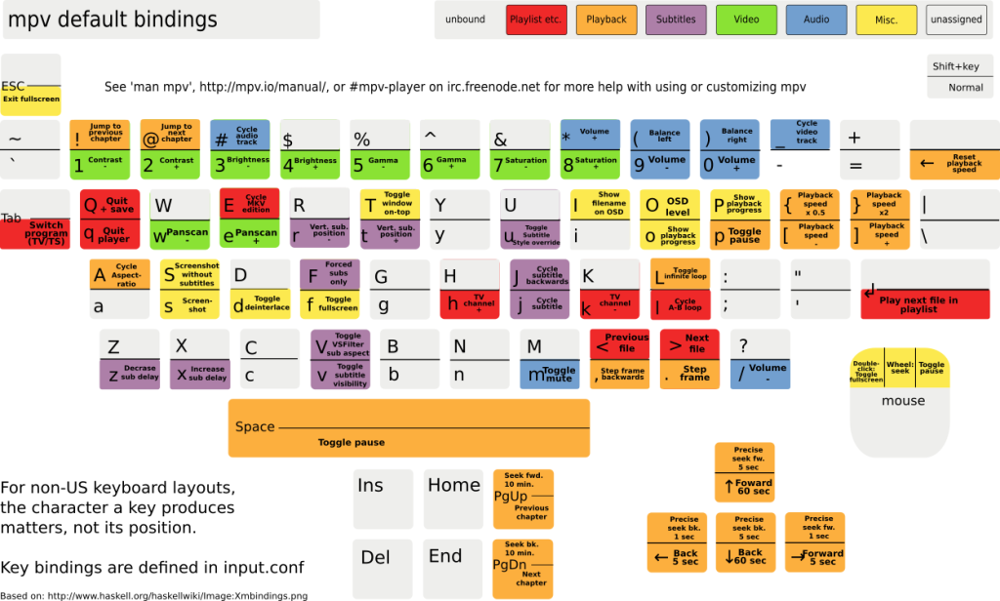

# 折腾下MPV

作为老二次元，一款称心如意的播放器肯定是需要有的。  
之前在 win 上是直接用的 potplayer + madvr + lav 但是 pot 也是个老东西了，之前就有想换 mpv 的，正好换系统，来弄一下。

## 读文档

这里感谢 hooke007 制作的[中文文档](https://hooke007.github.io/official_man/mpv.html#id1)。  

快捷键都是可以自己配置的，这方面我倾向于自己先用着，然后用的时候发现需求再去找快捷键。  
重点在于配置文件章节。  

### 位置和语法

系统级别的配置文件目录在 `/etc/mpv/` 或 `/usr/local/etc/mpv` 下，用户级的配置文件目录在 `~/.config/mpv/` 下。用户级的配置文件覆盖系统级的，命令行参数覆盖前两个。

配置文件使用 `option=value` 语法，`#` 之后的内容将被视为注释，不需要值的选项可以使用 `yes` 或者 `no`，如果值被省略，则默认为 `yes`。

### 配置预设

可以在设置文件中定义配置预设，一套配置预设以方块号的名称作为开头，后面的所有选项属于该配置预设。可以用 `--profile=help` 选项列出所有预设：

```sh
[atao@atodesk ~]$ mpv --profile=help
Available profiles:
	enc-to-hp-slate-7	MP4 for HP Slate 7 (1024x600, crazy aspect)
	enc-to-nok-6300	3GP for Nokia 6300
	enc-to-nok-n900	MP4 for Nokia N900
	enc-to-dvdntsc	DVD-Video NTSC, use dvdauthor -v ntsc -a ac3+en (MUST be used with 4:3 or 16:9 aspect, and 720x480, 704x480, 352x480 or 352x240 resolution)
	enc-to-dvdpal	DVD-Video PAL, use dvdauthor -v pal -a ac3+en (MUST be used with 4:3 or 16:9 aspect, and 720x576, 704x576, 352x576 or 352x288 resolution)
```

预设名字后面带的就是描述，可以在预设内用 `profile-desc` 来定义。要结束这个预设，可以开启另一个预设，或者使用名为 `default` 的预设。下面是一个带有预设配置的配置文件示例：


```
# 一般的顶层选项
fullscreen=yes

# 一个可以用 --profile=big-cache 启用的配置预设
[big-cache]
cache=yes
demuxer-max-bytes=512MiB
demuxer-readahead-secs=20

[network]
profile-desc="profile for content over network"
force-window=immediate
# 你也可以包含其它 profile
profile=big-cache

[reduce-judder]
video-sync=display-resample
interpolation=yes

# 再次使用这个 profile 来扩展它
[network]
demuxer-max-back-bytes=512MiB
# 引入一个内置的 profile
profile=fast
```

使用 `--profile=<name>` 选项在启动时应用配置预设

### default keymap



### Deband

